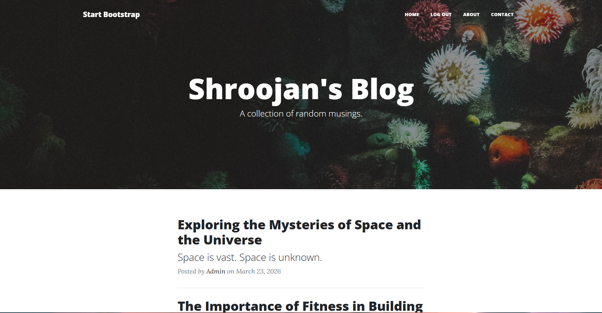
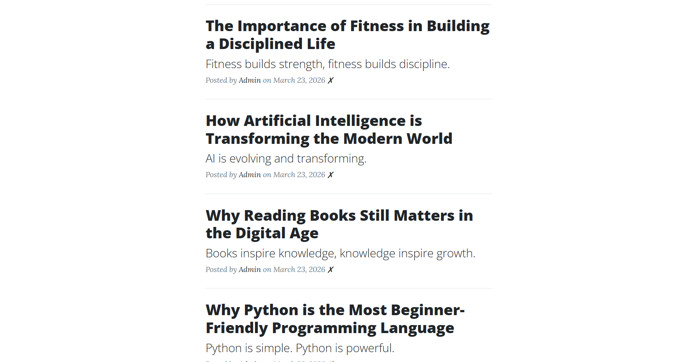
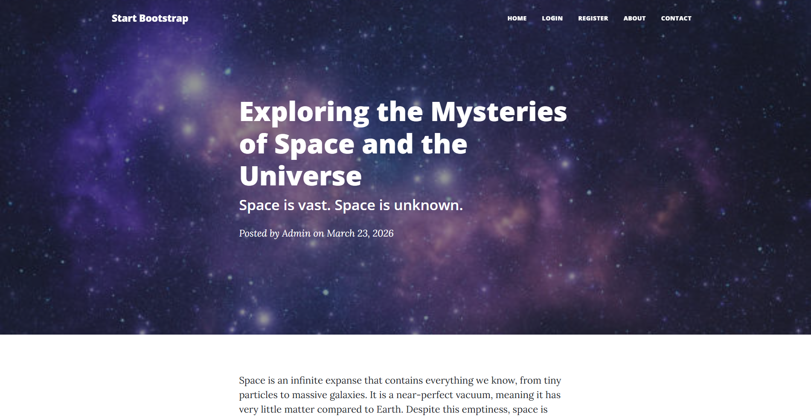
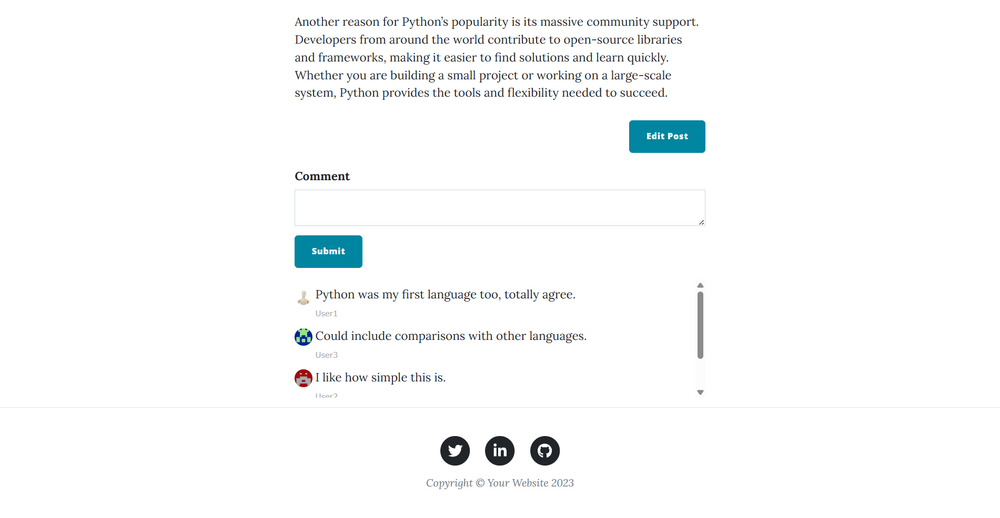
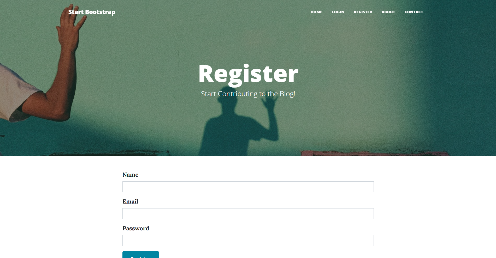
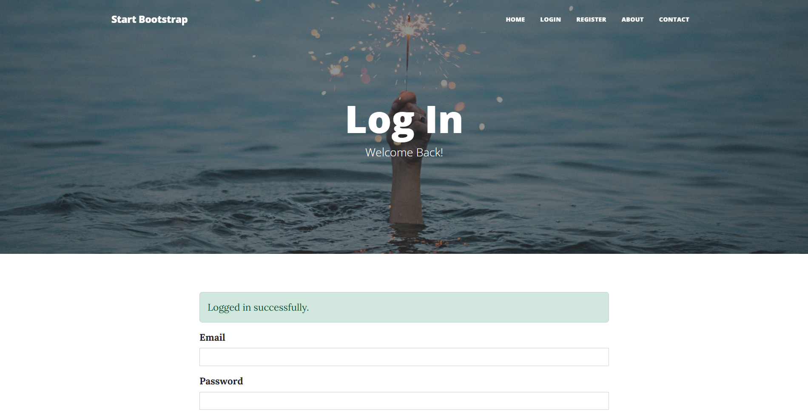
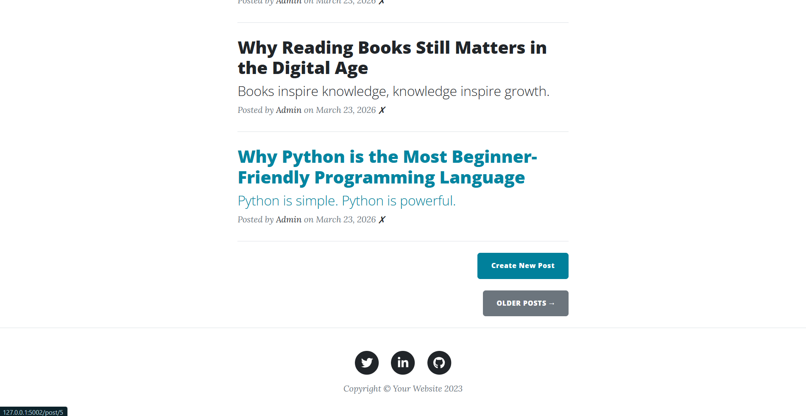

# Flask Blog Platform

A full-stack blogging web application built with Flask that enables users to create, manage, and interact with blog content through authentication, dynamic rendering, and a comment system.

This project demonstrates core backend development concepts including authentication, database design, ORM relationships, and server-side rendering using Flask.

---

## Features

### Authentication System

* User Registration with validation

* Secure Login/Logout using Flask-Login

* Password hashing using Werkzeug (`pbkdf2:sha256`)

* Session-based authentication

### Blog Management

* Create, Edit, and Delete blog posts (Admin only)

* Dynamic rendering of posts from database

* Rich text content support using CKEditor

* Image-based headers for each post

### Comment System

* Logged-in users can comment on posts

* Comments linked to both user and post

* Display of commenter name and avatar

* Real-time comment updates after submission

### User System

* Unique users stored in database

* One-to-many relationship: User → Posts

* One-to-many relationship: User → Comments

* Gravatar integration for profile images

### Frontend & UI

* Fully responsive design using Bootstrap 5

* Reusable templates (Header/Footer)

* Clean blog-style layout

* Flash messages for user feedback

---

## Project Structure

```
Flask-Blog-App
|
├── main.py                 # Core Flask application (routes, models, logic)
├── forms.py                # WTForms definitions (auth, posts, comments)
│
├── templates/              # Jinja2 templates
│   ├── index.html          # Homepage (all posts)
│   ├── post.html           # Individual blog post page
│   ├── login.html          # Login page
│   ├── register.html       # Registration page
│   ├── make-post.html      # Create/Edit post page
│   ├── header.html         # Navbar & metadata
│   └── footer.html         # Footer section
│
├── static/                 # Static assets
│   ├── css/
│   ├── js/
│   └── assets/
│
├── instance/               # SQLite database (ignored in Git)
├── requirements.txt        # Project dependencies
└── README.md
```

---

## Concepts Used

### Backend Development

* Flask application structure
* Routing and URL handling
* Request handling (GET/POST)

### Database & ORM

* SQLAlchemy ORM
* Table relationships:

  * One-to-Many (User → Posts)
  * One-to-Many (User → Comments)
  * One-to-Many (Post → Comments)
* Foreign keys and relational mapping

### Authentication & Security

* Flask-Login for session management
* Password hashing with Werkzeug
* Protected routes using decorators
* Admin-only access control

### Forms & Validation

* Flask-WTF forms
* Input validation
* CSRF protection

### Frontend Integration

* Jinja2 templating
* Dynamic content rendering
* Bootstrap styling
* Flash messaging system

### Rich Content Handling

* CKEditor integration for blog writing
* Safe rendering of HTML content

---

## How to Run

### 1. Clone the repository

```
git clone https://github.com/Shroojan2076/Flask-Blog-App.git

cd Flask-Blog-App
```

### 2. Create a virtual environment

```
python -m venv venv
source venv/bin/activate     # Mac/Linux
venv\Scripts\activate        # Windows
```

### 3. Install dependencies

```
pip install -r requirements.txt
```

### 4. Run the application

```
python main.py
```

### 5. Open in browser

```
http://127.0.0.1:5002
```

---

## Preview

### Homepage

* Displays all blog posts dynamically


* Shows author name and publish date


### Blog Post Page

* Full post content with rich formatting


* Comment section with user avatars


### Authentication Pages

* Clean login and registration UI


* Flash messages for feedback


### Admin Controls

* Create new posts


* Delete posts directly from homepage


---

## Design Highlights

* Minimal and clean blog UI inspired by modern publishing platforms

* Consistent layout using reusable components (header/footer)

* Fully responsive across devices

* Integration of rich text editor for better writing experience

* Gravatar-based avatars for personalization

* Smooth user experience with flash messaging

---

## Future Improvements

* Role-based access control (admin/user roles)
* Pagination for posts
* Search functionality
* Like / Bookmark system
* REST API integration
* AI-based blog summarization (planned extension)

---

## Author

**Shroojan Dhok**

* GitHub: https://github.com/Shroojan2076
* LinkedIn: https://www.linkedin.com/in/shroojan-dhok-679a73377/

---

## Support

If you found this project useful, consider giving it a ⭐️ on GitHub!
